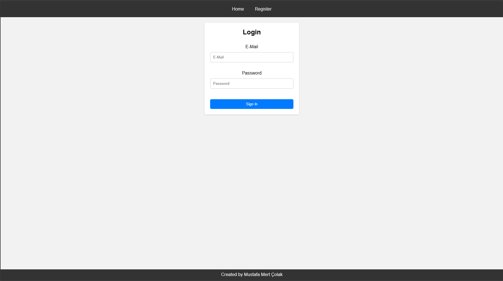

# Book Shopping Application(Start date: 28 April 2024)

This is a simple book shopping application built with Java Spring Boot, featuring RESTful APIs for managing books and a shopping cart.

## Screenshots

    

## Table of Contents
- [Introduction](#introduction)
- [Technologies Used](#technologies-used)
- [Endpoints](#endpoints)
- [Database](#database)
- [Features I Want to Add](#feautures-i-want-to-add)
- [Little Note](#little-note)

## Introduction

The Book Shopping Application provides endpoints for managing books and a shopping cart. It allows users to add books, view all books, get details of a specific book, delete books, add books to the shopping cart, view items in the cart, and calculate the total cost of items in the cart.

## Technologies Used

- Java
- Spring Boot
- PostgreSQL
- Maven

## Endpoints

### Books
#### Add Book
  - URL: /api/books/add
  - Method: POST
  - Request Body: JSON representation of the book
  - Response: Returns the added book with HTTP status OK

#### Get All Books
  - URL: /api/books/all
  - Method: GET
  - Response: Returns a list of all books with HTTP status OK

#### Get Book by ID
  - URL: /api/books/{id}
  - Method: GET
  - Response: Returns the book with the specified ID with HTTP status OK

#### Delete Book
  - URL: /api/books/deleteBook
  - Method: DELETE
  - Request Parameter: bookName
  - Response: Returns a success message if the book is deleted, or an error message with HTTP status METHOD_NOT_ALLOWED

### Cart
#### Add to Cart
  - URL: /cart/add/{id}
  - Method: POST
  - Path Variable: id (Book ID)
  - Response: Returns a success message with HTTP status OK

#### Show Cart
  - URL: /cart/show
  - Method: GET
  - Response: Returns a list of books in the cart with HTTP status OK

#### Show Total Cost
  - URL: /cart/totalCost
  - Method: GET
  - Response: Returns the total cost of items in the cart with HTTP status OK

## Database
This application uses "PostgreSQL" for data storage. Make sure to configure the database connection in application.properties.

## Features I Want to Add
  - UI
  - User system includes cart system and saving the cart in every session.

## Little Note
This is my first backend project and I learned a lot while doing this project and I continue to learn!

